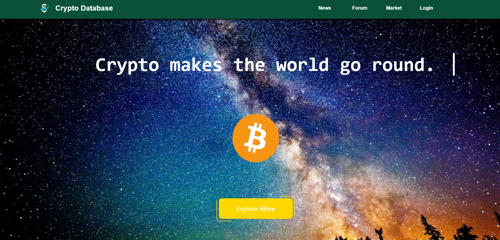
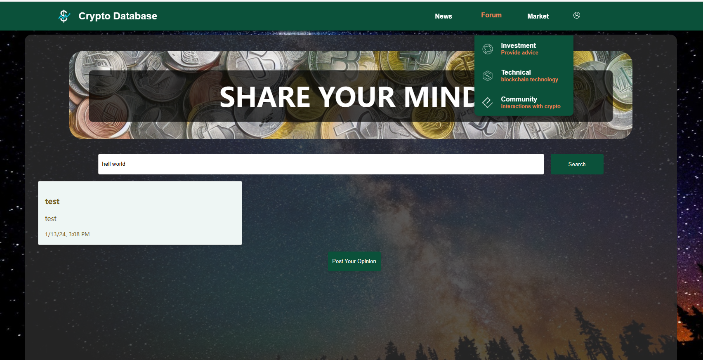
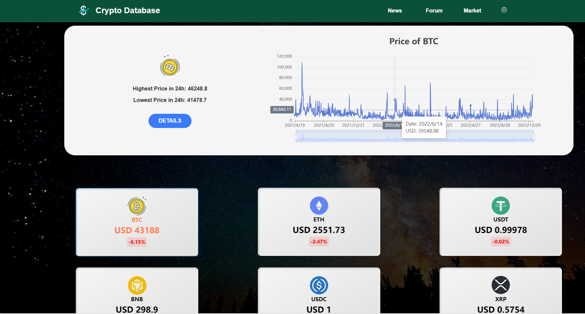
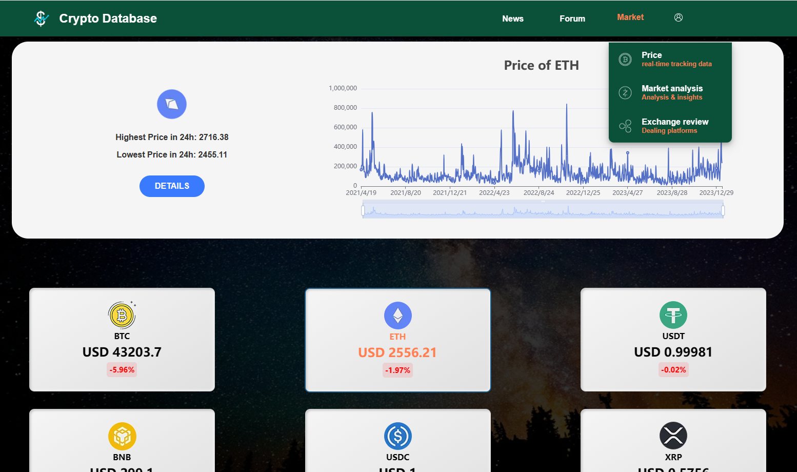

@[toc]
# 加密货币平台项目介绍

这个项目是一个基于 Flask 和 MongoDB 的深度学习应用程序，通过爬虫爬取加密货币行情和介绍信息，并根据新的数据使用LSTM去预测行情价格。展示涵盖了用户管理、新闻获取、加密货币数据处理、对话获取和处理、帖子管理等多个功能。

## 技术栈
- **后端**: Flask 提供了一个轻量级的网页服务器和后端API。
- **前端**: 使用angular+echart进行界面构建和图表绘制。
- **数据库**: 使用 MongoDB 作为数据库，用于存储用户信息、新闻、帖子和其他数据。
- **数据处理**: 对于加密货币价格预测，使用 LSTM 模型处理历史市场数据。
- **代理支持**: 在获取外部数据时支持通过代理访问。

### 1. 用户管理
- **注册（/signin）**: 允许新用户创建账户。系统会检查用户名是否已存在，并对密码进行加密保存。
- **登录（/login）**: 用户可以登录到系统。该接口验证用户名和密码的正确性。
- **密码修改（/modify）**: 用户可以修改他们的密码。
- **删除用户（/dele）**: 提供用户删除自己账户的功能。

### 2. 新闻和帖子管理
- **获取卡片详情（/card-details/<card_id>）**: 根据卡片ID获取加密货币相关新闻的详细信息。
- **上传帖子（/uploadpost）**: 允许用户上传新的帖子，包括标题、内容、日期等信息。
- **获取所有帖子（/getposts）**: 可以获取平台上所有用户上传的帖子。
- **更新帖子喜欢数（/updatelikes）** 和 **更新评论数（/updatecomments）**: 这两个接口允许用户更新帖子的喜欢数和评论数。

### 3. 加密货币数据
- **获取市场数据（/market）**: 从外部API获取实时的加密货币市场数据。
- **获取特定加密货币数据（/cryptos）**: 允许用户根据特定加密货币获取历史市场数据。
- **价格预测（/predict）**: 使用 LSTM 模型预测特定加密货币的未来价格。

### 4. 对话获取
- **获取对话（/dialog）**: 提供一个接口来获取存储的对话数据。

### 5. 数据获取
- **获取数据（/fetch_data 和 /fetch_data2）**: 这两个接口用于从指定的URL获取数据，支持代理设置。

